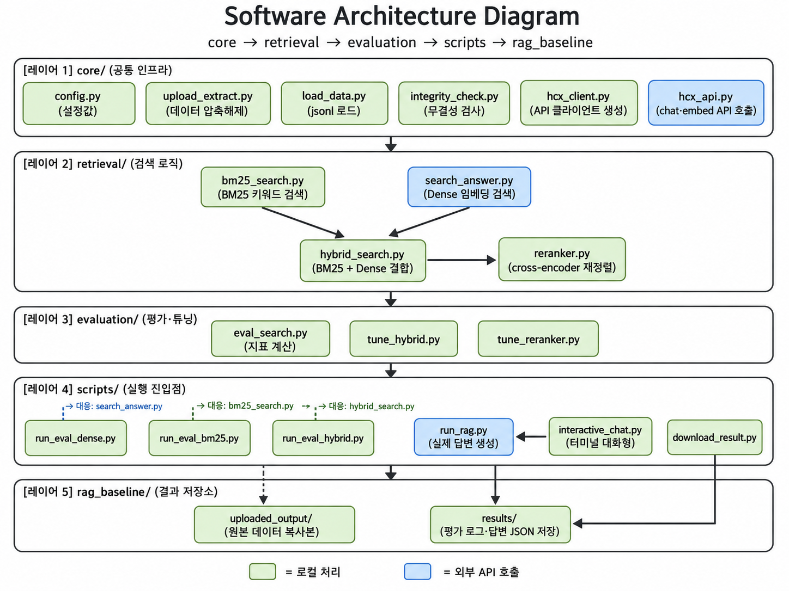

# RAG_project3

`KDIC_RAG_V4_7_INTERACTIVE_CHAT.ipynb`(Colab 노트북)을 셀 단위로 쪼개서 파일로 나눈 버전이며, 로컬에서도 그대로 돌아가도록 손봤습니다. 그러나 '크롤링 → 청킹 → 임베딩 모델로 벡터화 → 질문 벡터화 → 검색 → 답변 생성

## 1. 디렉터리 구조

```
RAG_project3/
├── core/                    # 공통 인프라 모듈
│   ├── config.py            # 모델명(HCX-005, bge-m3), Top-K, 작업 폴더 경로
│   ├── upload_extract.py    # data 폴더/zip 자동 인식 후 rag_baseline/uploaded_output/에 복사
│   ├── load_data.py         # documents/chunks/embeddings jsonl 3종 로드
│   ├── integrity_check.py   # ID 중복·임베딩 차원 검사
│   ├── hcx_client.py        # HCX_API_KEY 읽기, OpenAI 호환 클라이언트 생성
│   └── hcx_api.py           # chat·embed 호출 함수
├── retrieval/                # 검색 로직
│   ├── search_answer.py     # Dense(코사인 유사도) 검색 + 근거 기반 답변 생성
│   ├── bm25_search.py       # kiwipiepy 형태소 분석 + BM25Okapi 검색
│   ├── hybrid_search.py     # Dense+BM25를 Weighted-sum(Min-Max)로 융합 (확정값: pool=10, 7:3)
│   └── reranker.py          # BGE-Reranker-v2-m3(cross-encoder) 로컬 재정렬 (확정값: pool=50→상위25 재정렬)
├── evaluation/               # 평가·튜닝 하니스
│   ├── eval_search.py       # 지표 계산(hit@3·recall@5·mrr@10 등) + 평가 실행 함수
│   ├── tune_hybrid.py       # candidate_pool_size → fusion 방식 → weights 단계적 스윕
│   └── tune_reranker.py     # reranker에 넣을 후보 개수(N) 스윕 + 도메인별 breakdown (GPU 권장)
├── scripts/                  # 실행 진입점
│   ├── run_eval_dense.py    # Dense baseline 평가
│   ├── run_eval_bm25.py     # BM25 baseline 평가
│   ├── run_eval_hybrid.py   # Hybrid baseline 평가
│   ├── run_eval_rerank.py   # Hybrid+Reranker(N=25) 최종 평가 (GPU 권장)
│   ├── run_rag.py           # 질문 1건 실행, JSON 저장
│   ├── interactive_chat.py  # 터미널 대화형 질의응답 (메인 실행 파일)
│   └── download_result.py   # 로컬에선 결과 경로만 출력
├── artifacts/                 # 분석용 스크래치 파일
├── requirements.txt          # openai·numpy·pandas·FlagEmbedding 등
├── README.md
├── pyrightconfig.json         # Pylance/Pyright 임포트 경로 설정(extraPaths=".")
├── data/                      # documents.jsonl, chunks.jsonl, chunk_embeddings_hcx.jsonl, 평가 데이터셋(.xlsx) — 로컬 전용, .gitignore 처리
└── rag_baseline/              # uploaded_output(작업용 복사본), results(평가 로그·상세 CSV) — 실행 시 자동 생성
```

각 스크립트는 여전히 `RAG_project3`를 작업 디렉토리로 두고 실행합니다(예: `python scripts/interactive_chat.py`). `core.`/`retrieval.`/`evaluation.` 패키지 임포트를 위해 각 진입점 스크립트 상단에서 상위 폴더를 `sys.path`에 자동으로 추가해두었습니다.

## 2. 실행 흐름 (import 체인)

`interactive_chat.py`를 실행하면 아래 화살표를 타고 나머지 파일이 전부 순서대로 실행됩니다. 초록 = 로컬 파일 I/O, 파랑 = 외부 API 호출.



## 3. 실행 타임라인

**공통 초기화** — 어느 진입점을 실행하든 항상 먼저 이 순서로 준비됩니다.

1. **`core/config.py` 로드** — 모델명(`HCX-005`, `bge-m3`), Top-K, `WORK_ROOT` 설정
2. **`core/upload_extract.py`** — `data/` 또는 `KDIC_ZIP_PATH` 경로를 `rag_baseline/uploaded_output/`에 복사
3. **`core/load_data.py`** — documents / chunks / embeddings 로드
4. **`core/integrity_check.py`** — chunk_id 중복·누락, 임베딩 차원(1024) 검사
5. **`core/hcx_client.py`** — `HCX_API_KEY` 읽기, OpenAI 호환 클라이언트 생성

**이후 실행 목적에 따라 진입점이 갈라집니다.**

- **대화형 질의응답**: `scripts/interactive_chat.py` → `scripts/run_rag.py`(`run_kdic_rag()`) → `retrieval/search_answer.py`(Dense 검색 + HCX 근거 기반 답변 생성) → 질문마다 결과 JSON 저장 → *(optional)* `scripts/download_result.py`로 결과 경로 확인
- **Dense / BM25 / Hybrid 단독 평가**: `scripts/run_eval_dense.py` · `run_eval_bm25.py` · `run_eval_hybrid.py` → 각각 `retrieval/search_answer.py` / `retrieval/bm25_search.py` / `retrieval/hybrid_search.py` 호출 → `evaluation/eval_search.py`의 `evaluate_search()`로 지표(hit@3·recall@5·mrr@10·map@10·precision@5·f1@5·ndcg@5) 계산 → `rag_baseline/results/search_eval_log.csv` 및 문항별 `detail_*.csv`에 저장
- **하이브리드 하이퍼파라미터 튜닝**: `evaluation/tune_hybrid.py` — 질문당 Dense/BM25 후보를 한 번만 캐싱한 뒤 `candidate_pool_size → fusion 방식(RRF vs Weighted-sum) → weights(Dense:BM25)` 순으로 단계적 스윕 (확정값: pool=10, Weighted-sum·Min-Max, 7:3)
- **Reranker 튜닝**: `evaluation/tune_reranker.py` — `retrieval/hybrid_search.py`로 넉넉한 후보 pool을 확보한 뒤 `retrieval/reranker.py`(BGE-Reranker-v2-m3, 로컬 cross-encoder)로 재정렬 → 재정렬에 포함할 후보 개수(N) 스윕

## 환경 설정 및 실행

```powershell
cd RAG_project3
pip install -r requirements.txt
```

### HCX_API_KEY 설정 방법

`.env` 파일이나 코드에 직접 넣는 게 아니라, 터미널(PowerShell)에서 환경변수로 등록해서 씁니다.

**방법 1. 매번 입력 (제일 간단)**

PowerShell 켜고 이렇게 입력:
```powershell
$env:HCX_API_KEY = "여기에_실제_키"
```

같은 터미널 창에서 바로 이어서:
```powershell
cd RAG_project3
python interactive_chat.py
```

이 터미널 창을 닫으면 값이 사라지기 때문에, 새 창을 열 때마다 다시 입력해야 합니다.

**방법 2. 매번 안 치고 싶다면 (영구 등록)**

```powershell
setx HCX_API_KEY "여기에_실제_키"
```

한 번만 실행하면 이후 새로 여는 모든 터미널에 자동으로 반영됩니다. 단, 지금 열려 있는 창에는 바로 적용되지 않으니 새 터미널을 열어서 확인해야 합니다.

### 데이터 준비 및 실행

`documents.jsonl`, `chunks.jsonl`, `chunk_embeddings_hcx.jsonl`을 `RAG_project3/data/` 폴더에 넣어주세요. (다른 위치를 쓰고 싶으면 `KDIC_ZIP_PATH` 환경변수로 zip 경로 또는 폴더 경로를 지정하면 됩니다)

실행하면 import 체인을 타고 순서대로 다 실행됩니다:
```powershell
python interactive_chat.py
```

질문을 입력하면 검색 결과와 HCX 답변이 나옵니다. 종료하려면 `종료`/`끝`/`exit`/`quit`/`q` 중 아무거나 입력.

결과 JSON은 `rag_baseline/results/` 아래에 저장됩니다 (`.gitignore`로 제외돼 있어서 커밋은 안 됩니다).
