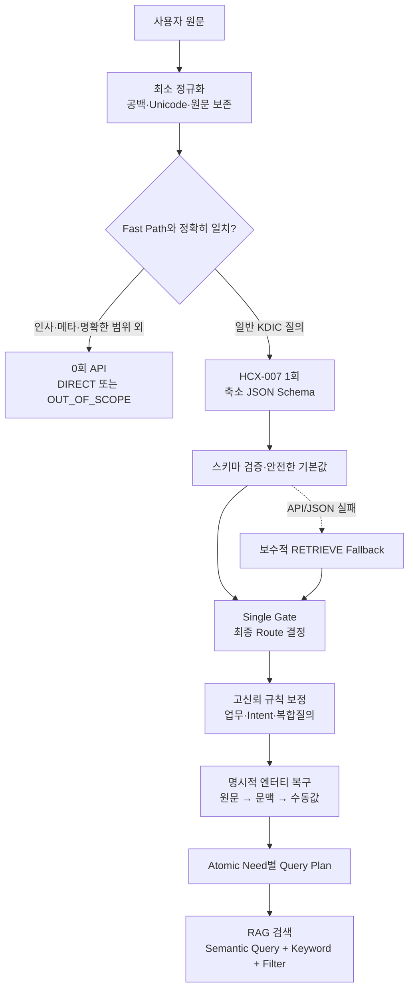
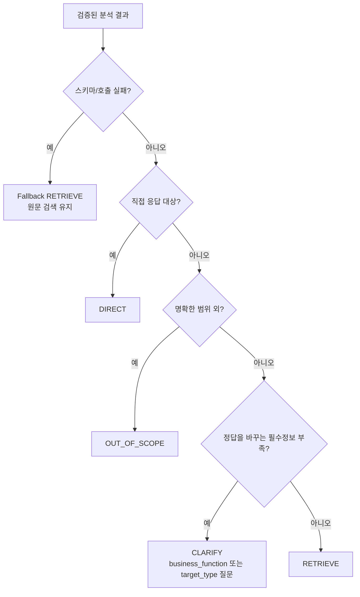

# KDIC 경량 RAG 질의분석 파이프라인 v2

## 1. 전체 흐름

## 2. 단계별 역할

| 단계 | 무엇을 하는가 | 왜 필요한가 | 비용 특성 |
|---|---|---|---|
| 최소 정규화 | 원문을 보존하고 Unicode·연속 공백만 정리 | 법률·금융 표현을 과도하게 바꾸는 것을 방지 | 로컬 문자열 처리 |
| Fast Path | 인사, 사용법, 명확한 범위 외 질문만 정확 일치 규칙으로 처리 | 불필요한 모델 호출 제거 | API 0회 |
| HCX 분석 | Route, Atomic Need, 업무, Intent, 검색에 필요한 조건만 생성 | 모호한 자연어와 복합질의를 의미 단위로 해석 | 일반적으로 API 1회 |
| 스키마 검증 | 타입·허용값·빈 Need를 검증하고 복구 | JSON이 생성돼도 의미상 잘못된 구조가 검색기로 전달되는 것을 차단 | 로컬 처리 |
| Single Gate | `DIRECT`, `OUT_OF_SCOPE`, `CLARIFY`, `RETRIEVE` 중 최종 행동 결정 | 모델의 Route와 서비스 정책을 분리 | 로컬 처리 |
| 규칙 보정 | 명시적 업무명, 강한 Intent 표현, 실제 복합 요구만 교정 | LLM의 반복 오류를 값싼 결정 규칙으로 보완 | 정규식·사전 조회 |
| 엔터티 복구 | 역할·신청인 유형은 원문/대화/수동 선택에 근거가 있을 때만 사용 | 추측한 역할이 검색 필터를 오염시키는 문제 방지 | 로컬 처리 |
| Query Plan | 각 Need에 semantic query, keyword query, filter, boost를 생성 | 검색기가 분석 JSON 전체를 해석하지 않게 함 | 로컬 처리 |

## 3. Single Gate

`CLARIFY`는 값이 단순히 추출되지 않았다는 이유로 선택하지 않는다. 현재 질문만으로 서로 다른 정답이 가능하고, 검색을 먼저 해도 해결되지 않는 필수정보가 빠진 경우에만 사용한다.

## 4. Atomic Need 분리 기준

- 분리한다: `필요 서류와 제출 방법`처럼 검색 의도가 서로 다를 때.
- 분리한다: 같은 업무·Intent라도 대상이나 상황이 달라 독립 문서 검색이 필요할 때.
- 합치지 않는다: `(업무, Intent)`가 같다는 이유만으로 대상이 다른 Need를 제거하지 않는다.
- 중복 제거한다: 업무, Intent, 독립 질의, 사례조건까지 같은 완전 중복일 때만.
- 재작성한다: 복합질의를 분리했거나 지시어를 문맥으로 복원해야 독립 검색이 가능한 Need만.
- 재작성하지 않는다: 이미 단독 검색 가능한 명확한 단일질의.

## 5. Query Plan의 필터 정책

| 근거 | 검색 적용 |
|---|---|
| 원문에 업무가 명시됨 | `business_filter=HARD` |
| 수동 선택 또는 확인된 대화 문맥 | `business_filter=HARD` |
| 모델만 업무를 추론함 | `business_filter=SOFT` |
| 업무가 불명확함 | 필터 없이 원문 Semantic Search |
| 역할·신청인 유형이 원문/문맥/수동값에 있음 | Keyword/Entity 조건에 포함 |
| 모델이 역할을 추측했거나 근거가 없음 | 검색 조건에서 제외 |

## 6. 경량화 포인트

1. 모든 질의를 재작성하지 않는다. Fast Path, 명확한 단일질의는 재작성 비용이 없다.
2. 일반 질의도 HCX 호출은 기본 1회이며, 재시도는 408·429·5xx·연결 오류에만 제한한다.
3. `business_confidence`, `intent_confidence`, 모델 추론 역할 필드를 출력 스키마에서 제거했다.
4. 최대 생성 토큰을 700으로 제한하고 `thinking.effort=none`을 사용한다.
5. Gate, Intent 보정, 엔터티 출처 판정, Query Plan 생성은 모두 로컬 규칙으로 처리한다.
6. `prompt_tokens`, `completion_tokens`, API 요청 수, 지연시간을 따로 기록해 실제 비용을 검증한다.

따라서 연산량의 핵심은 정규식 개수가 아니라 HCX 네트워크 호출이다. 추가된 로컬 규칙은 1회 API 호출에 비해 매우 작으며, Fast Path 비율만큼 전체 평균 호출량은 오히려 줄어든다.

## 7. 평가 시 반드시 구분할 지표

- `model_route_accuracy`: HCX가 처음 출력한 Route 정확도.
- `final_route_accuracy`: Single Gate 이후 실제 서비스 Route 정확도.
- `gate_improved_count` / `gate_regressed_count`: Gate의 순수 효과.
- `request_pair_micro_f1`: 중복을 포함한 Atomic Need 개수까지 평가.
- `request_pair_set_micro_f1`: 업무·Intent 조합의 존재 여부를 평가.
- `business_micro_f1` / `business_set_micro_f1`: 동일 업무의 복수 Need와 업무 커버리지를 분리 평가.
- `prompt_tokens` / `completion_tokens`: 프롬프트 비대화와 출력 비대화를 구분.
- `zero_call_rate`, `average_api_requests`, `p95_latency_ms`: 실제 경량화 효과 평가.

## 8. 권장 실행 순서

1. Colab에서 런타임을 다시 시작한다.
2. 노트북을 위에서부터 실행하고 `HCX_API_KEY`를 입력한다.
3. 기본 `SMOKE` 20건으로 API·파싱·Gate 회귀를 먼저 확인한다.
4. 오류가 없으면 `EVAL_MODE = "FULL"`로 바꾸어 270건을 실행한다.
5. 생성된 `kdic_lightweight_rag_v2_evaluation_bundle.zip`에서 요약, 문항별 결과, Route/Query Type 혼동표, Gate/규칙 적용 빈도를 검토한다.

