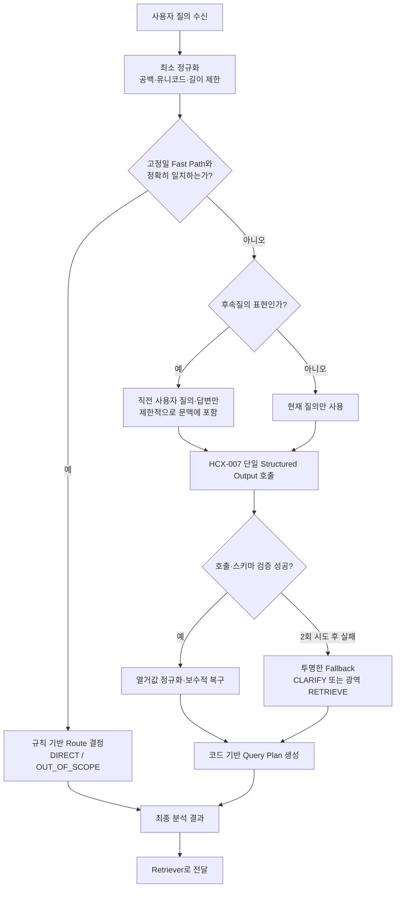
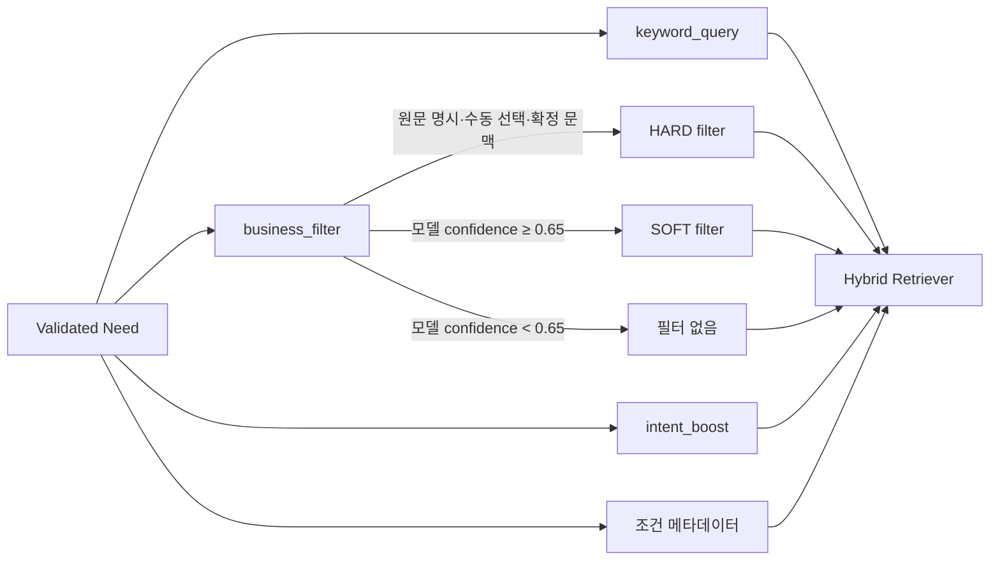

# KDIC 경량 RAG 질의분석 파이프라인

## 1. 실행 흐름



## 2. 왜 경량인가

이 파이프라인은 모든 질의에 여러 LLM 단계를 연쇄 적용하지 않는다. 규칙이 오판하기 어려운 인사·확인·기능 안내·명백한 범위 외 질의만 Fast Path로 처리하고, 실제 예금보험 업무 질의는 HCX-007을 **한 번만 호출**해 Route와 검색에 필요한 최소 슬롯을 함께 생성한다.

| 구간 | 수행 내용 | LLM 호출 |
|---|---|---:|
| Fast Path | 정확 일치 중심의 인사·확인·기능 안내·명백한 범위 외 판정 | 0회 |
| 일반 업무 질의 | Route, 단일·복합 Need, 업무·의도·조건 분석 | 원칙상 1회 |
| 일시적 API 실패 | 같은 요청을 한 번만 재시도 | 최대 2회 |
| 호출 최종 실패 | 실패 사유를 남기고 보수적 Fallback | 추가 호출 없음 |

## 3. HCX-007이 생성하는 최소 구조

```text
route
├─ RETRIEVE
│  └─ needs[]
│     ├─ need_id
│     ├─ query
│     ├─ business_function
│     ├─ business_confidence
│     ├─ intent
│     ├─ intent_confidence
│     ├─ user_role
│     ├─ applicant_type
│     ├─ target_type
│     └─ case_details
├─ CLARIFY
│  └─ missing_information[]
├─ DIRECT
└─ OUT_OF_SCOPE
```

`query`는 사용자의 의미를 보존한 검색용 표현이다. 스타일 개선 목적의 상시 rewriting은 하지 않으며, 생략된 후속질의 복원이나 복합질의 분리처럼 검색 정확도에 직접 필요한 경우에만 모델이 정리한다.

HCX-007 Structured Outputs의 공식 지원 타입에는 `null`이 포함되지 않으므로, 모델 출력에서는 근거 없는 범주형 값을 `UNKNOWN`, 자유 텍스트는 빈 문자열로 받는다. 검증 계층이 이를 내부 `None`으로 변환한다.

## 4. Query Plan의 책임 분리

LLM은 의미 판정까지만 담당하고 검색엔진별 옵션은 코드가 만든다.



이 구분은 낮은 확신의 업무 분류가 검색 후보를 완전히 제거하는 문제를 줄이기 위한 것이다. `HARD`는 원문에 업무명이 직접 있거나 수동 선택·확정 문맥으로 근거가 있을 때만 적용한다. 모델 추론만으로 얻은 분류는 confidence가 높아도 `SOFT`까지만 허용하고, 0.65 미만이면 필터를 사용하지 않는다.

## 5. 운영 시 관찰할 값

- `analysis_status`: `FAST_PATH`, `OK`, `REPAIRED`, `FALLBACK`, `ERROR`
- `api_request_count`: Fast Path 0, 정상 일반 질의 1, 재시도 시 2
- `total_tokens`: HCX 응답의 전체 토큰 사용량
- `latency_ms`: 질의분석 전체 지연시간
- `validation_warnings`: 모델 출력에서 코드가 복구한 항목
- `fallback_reason`: API 또는 출력 검증 실패 원인

평가는 먼저 `SMOKE` 모드의 소량 표본으로 API 인증·응답 구조·열거값을 확인한 다음 `FULL`로 전환한다. 이렇게 해야 잘못된 키나 요청 형식 때문에 전체 평가셋에 불필요한 호출을 발생시키는 일을 막을 수 있다.
