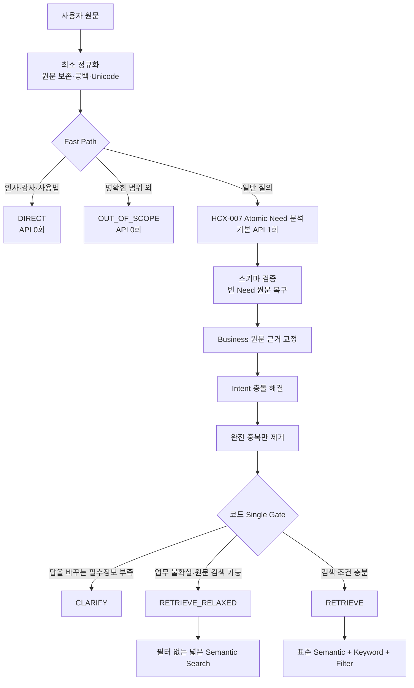
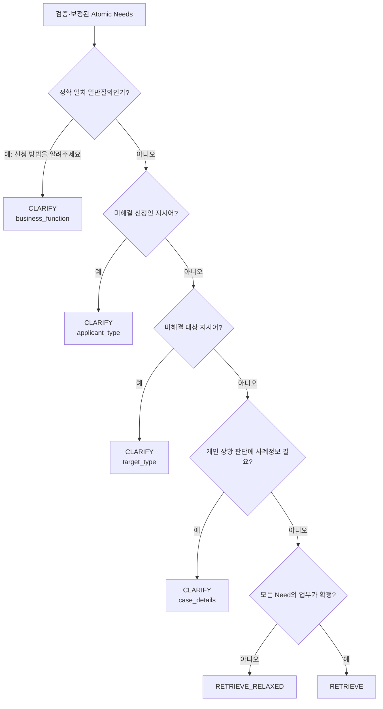
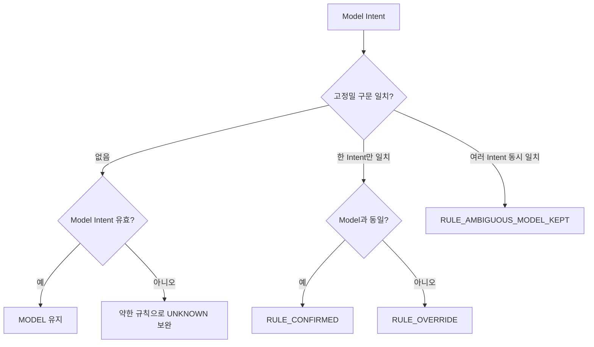

# KDIC 경량 RAG 질의분석 파이프라인 v3

## 핵심 변경

v3는 HCX가 최종 Route를 결정하지 않는다. HCX는 자연어에서 Atomic Need를 추출하고, 서비스 행동은 코드 기반 Single Gate가 단독으로 결정한다.



## HCX와 코드의 책임 분리

| 구성요소 | 담당 | 담당하지 않는 것 |
|---|---|---|
| HCX-007 | Atomic Need 분리, 독립 검색문, 업무, Intent, 대상·사례조건 | Route, CLARIFY, 직접 응답 정책 |
| Fast Path | 인사·메타·명확한 범위 외 질문 | 일반 KDIC 의미 분석 |
| Intent Resolver | 고정밀 완성 구문 교정, 충돌 기록 | 단일 키워드만으로 무조건 덮어쓰기 |
| Single Gate | CLARIFY, RETRIEVE, RETRIEVE_RELAXED 최종 결정 | Atomic Need 재작성 |
| Query Planner | 검색 모드, Semantic Query, Keyword, Filter, Boost | 사용자 의도 재판정 |

## v3 Structured Output

HCX 출력에는 `route`와 `missing_information`이 없다.

```json
{
  "needs": [
    {
      "need_id": "N1",
      "query": "예금보험금 신청에 필요한 서류",
      "business_function": "예금보험금 안내",
      "intent": "DOCUMENTS",
      "target_type": "",
      "case_details": []
    }
  ]
}
```

업무나 Intent가 불확실하면 `UNKNOWN`을 사용하되 Need를 삭제하지 않는다. 따라서 모델이 불확실해도 Gate가 원문 검색을 유지할 수 있다.

## Single Gate



### RETRIEVE_RELAXED

`RETRIEVE_RELAXED`는 실패나 CLARIFY의 다른 이름이 아니다. 사용자가 제공할 필요가 없는 불확실성을 검색 시스템이 흡수하는 Route다.

- 업무 필터를 강제로 걸지 않는다.
- 원문 또는 독립 Atomic Need를 Semantic Query로 사용한다.
- 모델이 제안한 업무는 soft hint로만 사용할 수 있다.
- 공개 평가에서는 검색 행동이므로 `RETRIEVE`로 정규화한다.

## Intent 충돌 처리



고정밀 규칙은 완성 구문을 사용한다.

| Intent | 대표 고정밀 구문 |
|---|---|
| DOCUMENTS | 필요한 서류, 제출 서류, 구비서류, 신분증, 위임장 |
| STATUS | 어디에서 확인, 조회 방법, 처리 결과, 진행 상황 |
| APPLICATION | 신청 방법, 접수 절차, 제출 방법, 신고 채널 |
| TIME | 언제까지, 신청 기한, 처리 기간, 얼마나 걸리는지 |
| AMOUNT | 보호한도, 지급금액, 계산 기준, 얼마여야 하는지 |
| CONTACT | 연락처, 전화번호, 문의처 |
| ELIGIBILITY | 신청 대상, 제외되는 경우, 포함되는지, 받을 수 있는지 |
| OVERVIEW | 의미, 정의, 차이, 종류, 개요 |

한 Atomic Need에서 두 고정밀 Intent가 동시에 탐지되면 첫 규칙으로 덮어쓰지 않는다. 유효한 모델 Intent를 유지하고 충돌 로그를 남긴다.

## Atomic Need 분리와 중복 제거

- Intent가 다르면 분리한다: `서류 + 제출 방법`.
- Intent가 같아도 대상·사례가 다르면 분리한다: `한 은행 여러 계좌 한도 + 여러 은행 한도`.
- 비교 질문은 대상×Intent의 Cartesian product로 과분리하지 않는다.
- 업무, Intent, 독립 query, target, case details가 모두 같은 완전 중복만 제거한다.
- 원문이 이미 독립 검색 가능하면 불필요하게 재작성하지 않는다.

## 평가 산출물

v3 평가 ZIP에는 다음이 포함된다.

- 전체 요약 JSON
- 문항별 CSV
- Route 및 Query Type 혼동표
- Gate 이유 및 규칙 적용 횟수
- 규칙 적용으로 Pair가 개선된 문항
- 규칙 적용으로 Pair가 회귀한 문항
- Route·Business·Intent·Query Type 오류 유형 집계
- 원시 JSONL

주요 확인 지표는 다음과 같다.

- `final_route_accuracy`
- `clarify_precision`, `clarify_recall`
- `standard_retrieve_rate`, `relaxed_retrieve_rate`
- `request_pair_micro_f1`
- `business_set_micro_f1`
- `intent_micro_f1`
- `rule_improved_pair_count`, `rule_regressed_pair_count`
- `zero_call_rate`, `average_total_tokens`, `p95_latency_ms`

## Colab 실행 순서

1. v3 노트북을 Colab에 업로드한다.
2. 런타임을 다시 시작하고 위에서부터 실행한다.
3. `HCX_API_KEY`를 입력한다.
4. 기본 `SMOKE` 20건을 실행한다.
5. Route, CLARIFY, 규칙 회귀, API 오류가 없으면 `EVAL_MODE = "FULL"`로 변경한다.
6. 생성된 `kdic_lightweight_rag_v3_evaluation_bundle.zip`을 내려받아 v2와 비교한다.

