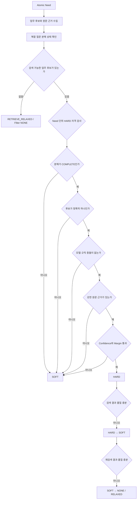

# KDIC 경량 RAG 질의분석 v3.1 구조

## 목표

V3의 공개 라우팅 정확도를 유지하면서 업무 분류 오류가 `HARD` 필터로 확정되어 정답 문서를 검색 대상에서 제거하는 문제를 방지한다.

## 필터 결정 흐름



## HARD 허용 조건

다음 조건을 모두 통과해야 한다.

1. need 분해 상태가 `COMPLETE`이다.
2. 해당 need의 업무 후보가 정확히 하나다.
3. 모델과 업무 규칙이 충돌하지 않는다.
4. 서로 다른 업무 용어가 동일 need 안에서 충돌하지 않는다.
5. 강한 업무 고유 표현이 원문 또는 사용자 확인 문맥에 존재한다.
6. 보정된 업무 confidence가 `0.98` 이상이다.
7. 후보 점수 차이가 `0.20` 이상이다.

하나라도 실패하면 업무 후보가 있을 때는 `SOFT`, 후보가 없을 때는 `NONE`과 `RETRIEVE_RELAXED`를 사용한다.

## 강한 근거와 약한 근거

- 강한 근거: `예금보험금`, `미수령금`, `착오송금`, `채무조정`, `은닉재산`처럼 업무를 직접 지칭하는 표현
- 약하거나 교차 가능한 근거: `보험사고`, `가지급금`, `개산지급금`처럼 여러 업무 문서에서 등장할 수 있는 표현

약한 근거만으로는 `HARD`를 허용하지 않는다.

## Fail-open 계약

질의 분석기는 실제 문서 검색기를 포함하지 않으므로 query plan에 다음 계약을 제공한다.

```json
{
  "fallback_policy": {
    "enabled": true,
    "on": ["NO_RESULTS", "LOW_TOP_SCORE", "LOW_COVERAGE"],
    "next_filter_modes": ["SOFT", "NONE"],
    "fail_open": true
  }
}
```

실제 검색기는 이 계약을 받아 결과 없음, 낮은 최고 점수, 낮은 문서 커버리지에서 필터를 자동 완화해야 한다.

## 평가 하드 게이트

| 지표 | 기준 |
|---|---:|
| 실행 성공률 | 99.5% 이상 |
| RETRIEVE 검색계획 유효율 | 99% 이상 |
| False OOS | 0건 |
| False DIRECT | 0건 |
| Wrong Hard Filter | 0건 |
| CLARIFY Precision | 95% 이상 |
| CLARIFY Recall | 95% 이상 |

평균 정확도가 높더라도 Wrong Hard Filter가 한 건이라도 있으면 배포를 중단한다.
