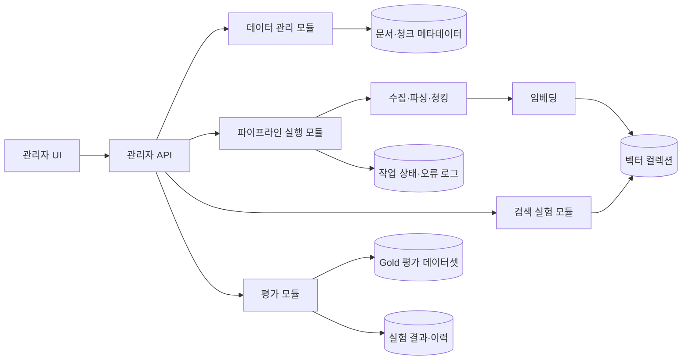

# 종합프로젝트 연구계획서

## AI 서비스 및 데이터 파이프라인 관리자 기능 구축

> RAG 데이터의 추가·갱신 과정과 검색 파라미터의 변경 효과를 운영자가 직접 확인하고 비교할 수 있는 관리자 시스템 구축

---

## 1. 프로젝트 개요

### 1.1 프로젝트명

**AI 서비스 및 데이터 파이프라인 관리자 기능 구축**

### 1.2 프로젝트 목적

실전 프로젝트 1에서 구축한 데이터 파이프라인과 실전 프로젝트 2에서 구현한 RAG 챗봇을 운영 가능한 형태로 확장한다.

관리자가 개발자의 직접 개입 없이 다음 작업을 수행할 수 있는 환경을 구축하는 것이 목적이다.

- 적재된 페이지·청크·메타데이터 조회
- 신규 URL의 파싱·청킹·벡터화 결과 사전 확인
- 데이터 추가·삭제 및 재수집·재적재 실행
- RAG 파라미터 변경 전후의 검색 결과 비교
- Gold 평가 데이터셋을 이용한 검색 품질 정량 평가
- 파이프라인 작업 상태와 실패 원인 확인

### 1.3 핵심 연구 주제

> 관리자 기능을 통해 RAG 데이터와 검색 파라미터를 안전하게 변경하고, 변경 전후의 품질을 동일한 평가 기준으로 재현·비교할 수 있는가?

---

## 2. 프로젝트 배경 및 필요성

RAG 챗봇의 답변 품질은 LLM뿐 아니라 적재 데이터의 품질, 청크 구조, 메타데이터와 검색 파라미터에 크게 영향을 받는다.

현재 구조에서는 데이터를 추가하거나 검색 속성값을 변경할 때마다 개발자가 코드를 실행하고 결과를 직접 확인해야 한다. 이 방식은 운영 과정에서 다음과 같은 문제를 발생시킬 수 있다.

- 신규 데이터가 잘못 파싱되거나 청크가 부적절하게 분리되어도 적재 전 확인이 어려움
- 메타데이터 누락으로 다른 업무의 청크가 검색 결과에 포함될 수 있음
- Top-K, 리랭킹과 같은 설정 변경의 효과를 객관적으로 비교하기 어려움
- 파이프라인 실행 여부와 실패 지점을 운영자가 즉시 확인하기 어려움
- Chunk Size와 청킹 방식 변경 시 전체 데이터의 재적재 비용이 발생함
- 검색 품질이 개선되었는지 판단할 공통 기준과 변경 이력이 부족함

따라서 데이터 변경과 파라미터 변경을 바로 운영 환경에 반영하기 전에 미리 확인하고, 테스트하고, 승인할 수 있는 관리자 시스템이 필요하다.

---

## 3. 해결하고자 하는 문제

### 문제 1. 데이터 변경 전 품질 확인의 어려움

신규 URL을 추가하면 파싱, 청킹과 메타데이터 생성 결과가 적절한지 확인하기 전에 운영 데이터에 포함될 수 있다.

### 문제 2. 검색 파라미터 변경 효과의 불확실성

Top-K나 리랭킹 설정을 변경했을 때 어떤 질문이 개선되고 어떤 질문이 악화되는지 한눈에 비교하기 어렵다.

### 문제 3. 적재 시점 파라미터의 높은 실험 비용

Chunk Size와 청킹 방식은 변경할 때마다 재청킹과 재임베딩이 필요하므로, 매 실험마다 전체 데이터를 재적재하면 시간과 비용이 증가한다.

### 문제 4. 파이프라인 운영 상태 확인의 어려움

재수집과 재적재 작업이 어느 단계까지 처리되었는지, 실패했다면 어떤 단계에서 문제가 발생했는지 확인할 수단이 부족하다.

### 문제 5. 품질 개선 여부를 판단할 공통 기준 부족

검색 결과를 일부 질문만 보고 판단하면 변경 효과를 객관적으로 설명하기 어렵다. 동일한 Gold 평가 데이터셋을 이용한 정량 비교가 필요하다.

---

## 4. 연구 목표

### 4.1 필수 목표

1. 적재된 페이지·청크·메타데이터를 조회·추가·삭제할 수 있는 관리자 UI를 구현한다.
2. 신규 URL의 파싱·청킹·메타데이터 결과를 적재 전에 미리 확인한다.
3. 동일한 질문에 대해 파라미터 변경 전후의 검색 결과를 나란히 비교한다.
4. 관리자 화면에서 재수집·재적재 작업을 실행하고 처리 상태를 확인한다.
5. Gold 평가 데이터셋을 이용하여 파라미터 변경 전후의 검색 품질을 정량 비교한다.

### 4.2 확장 목표

- 임베딩 모델별 검색 성능 비교
- 모호한 질문과 추가 질문 정책 평가
- 프롬프트 변경 및 버전 이력 관리
- 금칙어와 개인정보 마스킹 규칙 관리
- 토큰 사용량·질의 통계·오류 로그 대시보드
- LLM을 이용한 실험 결과 요약 리포트

---

## 5. 연구 질문 및 가설

### 5.1 연구 질문

| ID | 연구 질문 |
|---|---|
| RQ1 | 관리자가 신규 데이터를 적재하기 전에 파싱·청킹·메타데이터 오류를 발견할 수 있는가? |
| RQ2 | 검색 시점 파라미터 변경 전후의 결과를 동일 조건에서 즉시 비교할 수 있는가? |
| RQ3 | 적재 시점 파라미터를 소량의 테스트 컬렉션으로 비교해 전체 재적재 여부를 판단할 수 있는가? |
| RQ4 | Gold 평가 데이터셋을 이용해 검색 품질의 개선과 악화를 객관적으로 측정할 수 있는가? |
| RQ5 | 관리자 트리거 기반 파이프라인의 실행 상태와 실패 원인을 단계별로 확인할 수 있는가? |
| RQ6 | 서로 다른 임베딩 모델과 검색 방식이 질문 유형별 검색 성능에 어떤 차이를 만드는가? |

### 5.2 연구 가설

| ID | 가설 |
|---|---|
| H1 | 적재 전 미리보기를 제공하면 잘못 분리된 청크와 누락된 메타데이터를 운영 적재 전에 발견할 수 있다. |
| H2 | 동일 질문에 대한 A/B 검색 비교는 운영자가 파라미터 변경 효과를 직관적으로 판단하는 데 도움이 된다. |
| H3 | Hard Negative를 포함한 대표 테스트 컬렉션은 전체 재적재 없이도 설정 변경의 상대적 성능 차이를 재현할 수 있다. |
| H4 | 업무 필터링을 적용하면 다른 업무 청크의 혼입률이 감소한다. |
| H5 | Hybrid 검색과 Reranking은 Dense 검색 단독 방식보다 정답 청크의 상위 노출 가능성을 높일 것이다. |

---

## 6. 프로젝트 범위

### 6.1 필수 구현 범위

| 구분 | 구현 내용 |
|---|---|
| 데이터 조회 | 페이지, 청크, 업무 분류, 원문 URL과 메타데이터 조회 |
| 데이터 추가 | 신규 URL 등록과 파싱·청킹·벡터화 |
| 데이터 삭제 | 선택한 페이지와 연결된 청크 삭제 |
| 처리 결과 미리보기 | 파싱 텍스트, 청크 경계, 메타데이터와 첨부파일 확인 |
| 파라미터 테스트 | Top-K, 검색 방식, 리랭킹과 RRF 비율 비교 |
| 파이프라인 실행 | 재수집·재청킹·재임베딩·재적재 트리거 |
| 상태 확인 | 대기·실행 중·완료·실패 상태와 단계별 로그 표시 |
| 품질 평가 | Gold 테스트셋 기반 변경 전후 지표 비교 |

### 6.2 추가 구현 범위

- 프롬프트 버전과 변경 이력 관리
- 금칙어·개인정보 마스킹 규칙 관리
- 질의량·토큰 사용량·오류율 모니터링
- 변경 전후 답변 비교
- LLM 기반 실험 결과 요약

### 6.3 구현 제외 범위

- 관리자 화면에서 원문 웹페이지의 내용을 직접 수정하는 기능
- 개발자 승인 없이 운영 인덱스를 즉시 전체 교체하는 기능
- 대규모 분산 처리 환경과 고가용성 운영 인프라
- 실시간 자동 크롤링 스케줄러 전체 구현

---

## 7. 주요 사용자 및 사용 시나리오

### 7.1 주요 사용자

- **콘텐츠 관리자**: 신규 페이지 추가, 기존 데이터 확인과 삭제
- **서비스 운영자**: 파이프라인 실행, 진행 상태와 실패 로그 확인
- **RAG 품질 관리자**: 검색 파라미터 실험과 평가 결과 비교
- **개발자**: 파이프라인 오류 분석과 운영 설정 지원

### 7.2 대표 시나리오

#### 시나리오 A. 신규 URL 추가

1. 관리자가 신규 URL을 입력한다.
2. 시스템이 페이지를 수집하고 파싱한다.
3. 파싱된 본문, 메타데이터와 첨부파일을 미리 보여준다.
4. 임시 Chunk Size를 적용해 청킹 결과를 생성한다.
5. 관리자가 청크 경계와 메타데이터를 검토한다.
6. 승인 시 벡터화하여 운영 또는 스테이징 컬렉션에 적재한다.
7. 실패 시 원인과 처리 단계를 표시한다.

#### 시나리오 B. 검색 파라미터 비교

1. 관리자가 대표 질문 또는 평가 데이터셋을 선택한다.
2. 기준 설정 A와 후보 설정 B를 입력한다.
3. 시스템이 동일한 질문과 데이터에서 두 설정을 실행한다.
4. 순위, 검색 점수, 문서·섹션·청크와 업무 혼입 여부를 나란히 표시한다.
5. Gold 정답 포함 여부와 평가 지표를 비교한다.
6. 관리자가 변경안을 저장하거나 반영을 취소한다.

#### 시나리오 C. 데이터 갱신

1. 관리자가 재수집 또는 재적재 작업을 실행한다.
2. 시스템이 작업 ID를 생성한다.
3. 수집, 파싱, 청킹, 임베딩과 적재 단계의 상태를 표시한다.
4. 완료 시 처리 건수와 변경 내역을 제공한다.
5. 실패 시 실패 단계, 오류 메시지와 재시도 가능 여부를 제공한다.

---

## 8. 시스템 구성



### 8.1 논리적 계층

| 계층 | 역할 |
|---|---|
| 관리자 UI | 데이터 조회, 미리보기, 파라미터 비교와 작업 상태 표시 |
| 관리자 API | UI 요청 검증, 데이터 관리와 파이프라인 명령 전달 |
| 파이프라인 | 수집, 파싱, 청킹, 메타데이터 생성, 임베딩과 적재 |
| 검색 실험 | Dense·Keyword·Hybrid·Reranking 실행 |
| 평가 | Gold 청크와 검색 결과 비교, 지표 계산 |
| 저장소 | 운영·테스트 벡터 컬렉션, 메타데이터, 작업·실험 이력 |

---

## 9. 관리자 화면 구성

### 9.1 대시보드

- 적재 페이지 수
- 전체 청크 수
- 업무별 데이터 분포
- 최근 파이프라인 실행 상태
- 최근 실험 결과
- 실패 작업과 검토 대기 건수

### 9.2 데이터 관리

- 페이지 목록과 검색
- 업무 카테고리·URL·수집일 필터
- 페이지별 연결 청크 조회
- 신규 URL 등록
- 선택 데이터 삭제
- 원문 페이지 바로가기

### 9.3 처리 결과 미리보기

- 파싱된 Markdown 또는 텍스트
- 제목·헤더 구조
- 청크 ID와 청크 경계
- 예상 토큰 또는 글자 수
- `business_function`, `parent_doc_id`, URL과 breadcrumb
- 첨부파일 메타데이터
- 누락·중복·비정상 청크 경고
- 적재 승인·취소

### 9.4 파라미터 테스트

- 테스트 질문 입력 또는 평가 질문 선택
- 기준 설정 A와 후보 설정 B 입력
- 검색 결과 순위와 점수 비교
- Gold 청크 일치 여부 표시
- 다른 업무 청크 혼입 여부 표시
- 지표와 응답시간 비교
- 실험 결과 저장

### 9.5 파이프라인 관리

- 재수집·재청킹·재임베딩·재적재 실행
- 작업 ID와 요청자 기록
- 단계별 진행률
- 처리 성공·실패 건수
- 오류 메시지와 실패 단계
- 재시도와 작업 취소

### 9.6 평가 결과

- 모델·파라미터별 Hit@K와 MRR
- 업무별 성능
- 질문 복잡도별 성능
- 개선·악화·변화 없음 질문 목록
- 정답 청크 누락 사례
- Hard Negative 오검색 사례

---

## 10. 파라미터 분류와 반영 전략

RAG 파라미터는 변경 비용에 따라 두 종류로 구분한다.

### 10.1 검색 시점 파라미터

질의할 때 적용되므로 운영 인덱스를 변경하지 않고 즉시 비교할 수 있다.

| 파라미터 | 예시 | 실험 방식 |
|---|---|---|
| Top-K | 1, 3, 5, 10 | 동일 인덱스에 서로 다른 K 적용 |
| 검색 방식 | Dense, Keyword, Hybrid | 동일 질문의 검색 결과 비교 |
| Reranking | 사용·미사용 | 초기 검색 후보를 동일하게 유지하고 비교 |
| RRF 비율 | Dense와 Keyword 가중치 | 여러 조합으로 순위 변화 비교 |
| 업무 필터 | 사용·미사용 | 타 업무 청크 혼입률 비교 |
| 유사도 임계값 | 검색 결과 포함 기준 | 정답 누락과 불필요 청크 비율 비교 |

### 10.2 적재 시점 파라미터

변경 시 재청킹·재임베딩·재적재가 필요하므로 테스트용 컬렉션에서 먼저 비교한다.

| 파라미터 | 예시 | 실험 방식 |
|---|---|---|
| Chunk Size | 200자, 500자, 토큰 기준 | 대표 문서만 별도 청킹 |
| Chunk Overlap | 0, 50, 100 | 조건·예외의 경계 누락 비교 |
| 청킹 방식 | 고정 길이, 헤더 기반, 의미 기반 | 동일 문서의 청크 구조 비교 |
| 임베딩 모델 | 기준 모델과 후보 모델 | 동일 청크·질문으로 Dense 검색 비교 |
| 메타데이터 구성 | 계층 정보 포함·제외 | 필터링과 문맥 복원 성능 비교 |

### 10.3 반영 원칙

1. 변경 전 설정을 기준 버전으로 저장한다.
2. 후보 설정은 테스트 컬렉션에서 실행한다.
3. 동일한 Gold 평가셋으로 정량 평가한다.
4. 개선·악화 질문을 수기 검토한다.
5. 기준을 통과한 경우에만 운영 반영 후보로 승인한다.
6. 운영 반영 전 이전 설정으로 복구할 수 있는 정보를 저장한다.

---

## 11. 실험 설계

### 11.1 실험 원칙

- 한 번의 실험에서는 비교하려는 변수 외 조건을 동일하게 유지한다.
- 동일한 질문, Gold 정답, 데이터와 필터 조건을 사용한다.
- 임베딩 모델 비교와 Hybrid·Reranking 비교를 분리한다.
- 전체 평균뿐 아니라 업무와 질문 유형별 결과를 확인한다.
- 품질뿐 아니라 처리 시간과 저장 비용도 함께 기록한다.

### 11.2 실험 1. 임베딩 모델 비교

#### 목적

현재 임베딩 모델과 후보 모델 중 예금보험 도메인의 질문·청크 검색에 적합한 모델을 객관적으로 선정한다.

#### 고정 조건

- 동일한 427개 청크
- 동일한 평가 질문
- 동일한 업무 필터
- 동일한 Top-K
- 동일한 유사도 계산 기준
- Keyword 검색과 Reranking 미사용

#### 비교 항목

- Hit@1, Hit@3, Hit@5
- MRR
- Recall@K
- 업무 혼입률
- 평균 임베딩 시간
- 평균 검색시간
- 벡터 차원과 저장 용량

### 11.3 실험 2. 검색 방식 비교

#### 비교 대상

1. Dense 검색
2. Keyword 검색
3. Hybrid 검색
4. Hybrid 검색 + Reranking

#### 분석 기준

- 전체 질문 평균
- 6개 업무별 결과
- 단순·조건부·복합·모호 질문별 결과
- 타 업무의 유사 문구가 포함된 Hard Negative 질문

### 11.4 실험 3. Chunk Size 비교

#### 비교 예시

- 설정 A: 200자 단위
- 설정 B: 500자 단위
- 설정 C: 헤더 기반 + 최대 길이 제한

#### 확인 항목

- 정답 정보가 하나의 청크에 포함되는지
- 조건과 예외가 청크 경계에서 분리되는지
- 검색 결과에 불필요한 문맥이 과도하게 포함되는지
- 정답 청크의 순위와 검색 점수
- 청크 수·임베딩 비용·검색시간 변화

### 11.5 테스트 컬렉션 구성

적재 시점 파라미터는 전체 데이터를 매번 재적재하지 않고 대표 문서를 이용해 테스트한다.

테스트 컬렉션에는 다음 데이터를 포함한다.

- 6개 업무별 대표 문서
- 금액·기한·신청 방법 등 조건이 많은 문서
- 첨부파일과 민원 신청 링크가 포함된 문서
- 여러 업무에 유사한 표현이 반복되는 문서
- 정답 청크와 혼동하기 쉬운 Hard Negative 청크

테스트 컬렉션이 전체 데이터의 업무·문서 유형·청크 길이 분포를 일정 수준 재현하는지 확인한 후 실험에 사용한다.

---

## 12. 평가 데이터셋 연동

### 12.1 활용 데이터

- 6개 업무별 예상 질문
- 범위 밖 질문
- 조건부·복합·모호 질문
- Gold 업무 라벨
- Gold 문서·섹션·청크
- 정답 출처 URL
- 추가 질문 필요 여부
- 필수응답요소와 응답정책

### 12.2 모호 질문 관련 권장 필드

| 필드 | 설명 |
|---|---|
| `question_complexity` | `ambiguous` 여부 |
| `ambiguity_type` | 업무 불명확, 의도 불명확, 조건 부족 등 |
| `missing_information` | 답변을 위해 부족한 조건 |
| `candidate_business_functions` | 가능한 업무 후보 |
| `gold_requires_clarification` | 추가 질문 필요 여부 |
| `gold_clarification_question` | 기대하는 추가 질문 |
| `gold_clarification_options` | 사용자에게 제시할 선택 후보 |

### 12.3 주요 검색 평가 지표

| 지표 | 설명 |
|---|---|
| Hit@K | 상위 K개 결과에 Gold 청크가 포함된 질문 비율 |
| MRR | 첫 번째 Gold 청크 순위의 역수 평균 |
| Recall@K | 질문별 여러 Gold 청크 중 상위 K개에서 찾은 비율 |
| nDCG@K | 관련도와 순서를 함께 반영한 순위 품질 |
| 업무 혼입률 | 다른 업무 청크가 검색 결과에 포함된 비율 |
| 무응답 적절성 | 근거가 없는 질문에 임의 답변하지 않은 비율 |
| 추가 질문 적절성 | 모호한 질문에 필요한 조건을 올바르게 요청한 비율 |

### 12.4 운영 평가 지표

- 평균 검색시간
- 평균 파이프라인 처리시간
- URL당 생성 청크 수
- 메타데이터 누락률
- 파싱 실패율
- 적재 실패율
- 설정 변경 후 개선·악화 질문 비율
- 이전 설정으로 복구하는 데 필요한 시간

---

## 13. 데이터 및 상태 관리 구조

### 13.1 주요 엔터티

| 엔터티 | 주요 필드 |
|---|---|
| `documents` | 문서 ID, URL, 제목, 업무, 수집일, 상태, 콘텐츠 해시 |
| `chunks` | 청크 ID, 문서 ID, 상위 문서 ID, 본문, 순서, 길이 |
| `metadata` | 업무, 하위 카테고리, breadcrumb, 첨부파일 정보 |
| `pipeline_jobs` | 작업 ID, 작업 유형, 요청자, 상태, 시작·종료 시간 |
| `job_steps` | 수집·파싱·청킹·임베딩·적재 단계별 상태와 오류 |
| `parameter_versions` | 설정 버전, 파라미터 JSON, 생성자, 적용 상태 |
| `experiments` | 기준·후보 설정, 데이터셋 버전, 실행 일시 |
| `experiment_results` | 질문별 순위, 점수, Gold 적중 여부와 지표 |

### 13.2 데이터 상태

```text
DRAFT
  → PARSED
  → CHUNKED
  → REVIEW_REQUIRED
  → APPROVED
  → EMBEDDED
  → INDEXED

실패 시
  → FAILED
```

운영 데이터에 반영하기 전에 `REVIEW_REQUIRED`와 `APPROVED` 단계를 거치도록 한다.

---

## 14. 관리자 API 초안

> 실제 엔드포인트와 요청 형식은 구현 단계에서 팀 합의 후 확정한다.

### 14.1 데이터 관리

| Method | Endpoint | 기능 |
|---|---|---|
| GET | `/admin/documents` | 문서 목록 조회 |
| GET | `/admin/documents/{document_id}` | 문서·메타데이터 상세 조회 |
| GET | `/admin/documents/{document_id}/chunks` | 연결 청크 조회 |
| POST | `/admin/documents/preview` | 신규 URL 파싱·청킹 미리보기 |
| POST | `/admin/documents` | 검토 완료 데이터 적재 |
| DELETE | `/admin/documents/{document_id}` | 문서와 연결 청크 삭제 |

### 14.2 파이프라인

| Method | Endpoint | 기능 |
|---|---|---|
| POST | `/admin/jobs/recrawl` | 재수집 작업 실행 |
| POST | `/admin/jobs/reindex` | 재적재 작업 실행 |
| GET | `/admin/jobs` | 작업 목록 조회 |
| GET | `/admin/jobs/{job_id}` | 단계별 작업 상태 조회 |
| POST | `/admin/jobs/{job_id}/retry` | 실패 작업 재시도 |

### 14.3 검색·평가

| Method | Endpoint | 기능 |
|---|---|---|
| POST | `/admin/search/compare` | 설정 A/B 검색 결과 비교 |
| POST | `/admin/evaluations/run` | 평가 데이터셋 전체 실행 |
| GET | `/admin/evaluations/{evaluation_id}` | 평가 결과 조회 |
| GET | `/admin/parameters` | 파라미터 버전 목록 |
| POST | `/admin/parameters` | 신규 파라미터 버전 저장 |
| POST | `/admin/parameters/{version_id}/apply` | 승인된 설정 반영 |

---

## 15. 기술 스택 초안

> 기존 프로젝트 산출물과 팀의 구현 역량을 고려한 초기 제안이며, 설계 확정 과정에서 변경할 수 있다.

| 구분 | 기술 후보 |
|---|---|
| 언어 | Python, JavaScript |
| 관리자 API | FastAPI |
| 관리자 UI | Streamlit 또는 React |
| 데이터 처리 | Pandas, BeautifulSoup, Markdown 변환 도구 |
| 임베딩 | BGE-M3 및 비교 후보 모델 |
| 검색 | Dense Retrieval, Keyword, Hybrid, RRF, Reranking |
| 메타데이터 저장 | SQLite 또는 PostgreSQL |
| 벡터 저장소 | 프로젝트 1에서 사용한 벡터 저장 구조 재사용 |
| 평가 | Pandas, NumPy, 자체 Hit@K·MRR 계산 모듈 |
| 테스트 | Pytest |
| 형상 관리 | Git, GitHub |

### 기술 선택 원칙

- 기존 산출물을 최대한 재사용한다.
- MVP에서는 구현 속도와 검증 가능성을 우선한다.
- UI와 파이프라인 로직을 분리한다.
- 운영 인덱스와 테스트 인덱스를 구분한다.
- 파라미터와 평가 결과를 파일이 아닌 버전 단위로 관리한다.

---

## 16. 구현 단계 및 일정

### Milestone 1. 기준 확정

- 기존 데이터·파이프라인·챗봇 코드 구조 확인
- 관리자 기능의 필수·추가 범위 구분
- 데이터 스키마와 API 규격 초안 작성
- 평가 데이터셋 및 Gold 상태 점검

### Milestone 2. 데이터 관리 MVP

- 문서·청크 목록 조회
- 문서 상세와 원문 URL 표시
- 신규 URL 입력
- 파싱·청킹 결과 미리보기
- 승인 후 적재
- 데이터 삭제

### Milestone 3. 파이프라인 관리

- 작업 ID 발급
- 재수집·재적재 트리거
- 단계별 상태 저장
- 실패 로그와 재시도

### Milestone 4. 파라미터 비교 및 평가

- 검색 설정 A/B 비교
- 평가 데이터셋 전체 실행
- Hit@K·MRR·업무 혼입률 계산
- 질문별 개선·악화 결과 표시

### Milestone 5. 통합·검수·시연

- 관리자 UI와 API 통합
- 대표 시나리오 E2E 테스트
- 오류와 예외 처리
- 운영 가이드 작성
- 시연 영상 및 최종 발표자료 제작

---

## 17. 역할 분담 예시

| 역할 | 주요 업무 |
|---|---|
| 데이터·파이프라인 | 수집·파싱·청킹·임베딩·적재 함수 분리 및 작업 상태 관리 |
| 관리자 API | 데이터·작업·검색·평가 API 구현 |
| 관리자 UI | 데이터 관리, 미리보기, A/B 비교와 상태 화면 |
| 평가·품질 | Gold 데이터 검수, 지표 구현, 모델·파라미터 실험 |
| 문서·통합 | API 명세, 운영 가이드, 테스트 시나리오와 발표자료 |

### 협업 원칙

- 기능별 담당자를 정하되 결과는 다른 팀원이 실행해 본다.
- 데이터 스키마와 API 형식은 구현 전에 합의한다.
- 공통 샘플 데이터와 테스트 질문을 사용한다.
- 작업 결과는 Pull Request 단위로 검토한다.
- 코드뿐 아니라 실행 방법과 검증 결과를 함께 기록한다.

---

## 18. GitHub 운영 계획

### 18.1 권장 저장소 구조

```text
project-root/
├─ README.md
├─ docs/
│  ├─ research-plan.md
│  ├─ api-spec.md
│  ├─ operation-guide.md
│  └─ experiment-scenarios.md
├─ admin_ui/
├─ admin_api/
├─ pipeline/
│  ├─ crawler/
│  ├─ parser/
│  ├─ chunker/
│  ├─ embedding/
│  └─ indexing/
├─ retrieval/
├─ evaluation/
├─ tests/
├─ data/
│  ├─ samples/
│  └─ schemas/
├─ scripts/
├─ .env.example
└─ requirements.txt
```

### 18.2 브랜치 및 Pull Request

- `main`: 시연 가능한 안정 버전
- `develop`: 통합 개발
- `feature/*`: 기능별 작업
- `fix/*`: 오류 수정

Pull Request에는 다음 내용을 기록한다.

- 구현 또는 변경 내용
- 실행 방법
- 테스트 방법과 결과
- 변경된 데이터 스키마 또는 API
- 화면 캡처
- 남은 문제

### 18.3 GitHub Issue 권장 라벨

- `data`
- `pipeline`
- `admin-ui`
- `admin-api`
- `retrieval`
- `evaluation`
- `bug`
- `documentation`
- `discussion`

---

## 19. 위험 요소 및 대응 방안

| 위험 요소 | 대응 방안 |
|---|---|
| 잘못된 데이터가 운영 인덱스에 반영됨 | 미리보기·승인·스테이징 단계를 거친 뒤 반영 |
| 전체 재적재에 많은 시간과 비용이 발생함 | 대표 테스트 컬렉션에서 먼저 비교 |
| 테스트 컬렉션이 전체 데이터 분포를 재현하지 못함 | 업무별 대표 문서와 Hard Negative를 포함하고 분포 점검 |
| 여러 파라미터를 동시에 변경해 원인을 분석하기 어려움 | 한 번의 실험에서 하나의 주요 변수만 변경 |
| Gold 정답 자체가 잘못 지정됨 | 담당자 검수 후 다른 팀원의 교차 검수 |
| 파이프라인 작업이 중단되거나 중복 실행됨 | 작업 ID, 단계별 상태, 중복 실행 방지와 재시도 구현 |
| 삭제 기능으로 데이터가 복구 불가능해짐 | 소프트 삭제 또는 삭제 전 백업·확인 절차 적용 |
| UI와 파이프라인 개발이 서로 다른 형식으로 진행됨 | API와 데이터 스키마를 먼저 확정 |
| 일정 안에 추가 기능까지 구현하기 어려움 | 필수 MVP 완료 후 가드레일·모니터링 기능 진행 |

---

## 20. 테스트 계획

### 20.1 기능 테스트

- 페이지·청크 목록이 정상적으로 조회되는가?
- 신규 URL의 파싱·청킹 결과가 적재 전에 표시되는가?
- 승인하지 않은 데이터가 운영 컬렉션에 적재되지 않는가?
- 문서 삭제 시 연결 청크가 함께 처리되는가?
- 재수집·재적재 작업 상태가 단계별로 표시되는가?
- 실패 단계와 오류 메시지를 확인할 수 있는가?

### 20.2 검색 테스트

- 동일 질문에 설정 A와 B가 같은 데이터에서 실행되는가?
- Top-K 변경에 따라 검색 결과 수와 순위가 올바르게 달라지는가?
- 업무 필터 적용 시 다른 업무 청크가 제외되는가?
- Reranking 적용 전후의 순위가 정상적으로 표시되는가?
- Gold 청크 포함 여부가 정확하게 계산되는가?

### 20.3 대표 E2E 시나리오

1. 신규 URL 등록
2. 파싱·청킹 미리보기
3. 메타데이터 확인
4. 적재 승인
5. 벡터 컬렉션 반영
6. 대표 질문 검색
7. Gold 청크 적중 확인
8. 파라미터 A/B 비교
9. 설정 반영 또는 취소
10. 작업·실험 이력 확인

---

## 21. 완료 기준

### 데이터 관리

- [ ] 페이지와 청크 목록을 조회할 수 있다.
- [ ] 신규 URL의 파싱·청킹 결과를 적재 전에 확인할 수 있다.
- [ ] 승인된 데이터만 적재할 수 있다.
- [ ] 선택한 데이터를 안전하게 삭제할 수 있다.

### 파이프라인

- [ ] 관리자 화면에서 재수집·재적재를 실행할 수 있다.
- [ ] 대기·실행 중·완료·실패 상태를 확인할 수 있다.
- [ ] 실패 단계와 오류 메시지를 확인할 수 있다.

### 검색 실험

- [ ] 동일 질의에 대해 설정 A와 B를 비교할 수 있다.
- [ ] Top-K와 리랭킹 등 검색 시점 파라미터를 즉시 비교할 수 있다.
- [ ] Chunk Size 등 적재 시점 파라미터를 테스트 컬렉션에서 비교할 수 있다.

### 평가

- [ ] Gold 평가 데이터셋으로 Hit@K와 MRR을 계산할 수 있다.
- [ ] 질문별 개선·악화 여부를 확인할 수 있다.
- [ ] 업무별·질문 유형별 결과를 확인할 수 있다.

### 문서화

- [ ] 관리자 기능 실행 방법을 문서화한다.
- [ ] 데이터 추가·갱신·삭제 절차를 문서화한다.
- [ ] 파라미터 실험 조건과 결과를 기록한다.
- [ ] 대표 시연 시나리오를 문서화한다.

---

## 22. 기대 효과

- 개발자의 직접 개입 없이 운영자가 데이터와 파이프라인 상태를 확인할 수 있다.
- 잘못된 파싱·청킹·메타데이터를 운영 적재 전에 발견할 수 있다.
- 검색 파라미터 변경 효과를 동일한 조건에서 비교할 수 있다.
- 전체 재적재가 필요한 변경과 즉시 비교 가능한 변경을 구분할 수 있다.
- Gold 평가 데이터셋을 이용해 설정 변경의 근거를 객관적으로 제시할 수 있다.
- 데이터 수집부터 검색·답변·평가·운영으로 이어지는 RAG 서비스의 전체 생명주기를 경험할 수 있다.

---

## 23. 예상 산출물

1. 관리자 UI
   - 데이터 관리
   - 처리 결과 미리보기
   - 파라미터 A/B 테스트
   - 파이프라인 상태
   - 평가 결과

2. 관리자 API
   - 데이터 조회·추가·삭제
   - 파이프라인 실행
   - 검색 비교
   - 평가 실행

3. 파라미터 테스트 시나리오 문서
   - 대표 질문
   - 기준·후보 설정
   - 검색 결과와 지표
   - 개선·악화 사례

4. 운영 가이드
   - 데이터 추가와 승인
   - 재수집·재적재
   - 파라미터 테스트와 반영
   - 실패 작업 확인과 복구

5. 최종 보고서 및 시연 영상

---

## 24. 초기 의사결정 항목

프로젝트 시작 시 다음 항목을 팀 회의에서 우선 확정한다.

- [ ] 관리자 UI를 Streamlit으로 구현할지 React로 구현할지
- [ ] 관리자 API와 파이프라인의 실행 방식을 동기·비동기 중 어떻게 구성할지
- [ ] 메타데이터와 작업 이력을 저장할 DB
- [ ] 운영·스테이징·실험 벡터 컬렉션의 분리 방식
- [ ] 데이터 삭제 시 소프트 삭제와 실제 삭제 정책
- [ ] 임베딩 모델 비교 후보
- [ ] Keyword·Hybrid·Reranking 구현 방식
- [ ] 테스트 컬렉션의 문서와 Hard Negative 구성
- [ ] 평가 데이터셋의 필수 필드와 모호 질문 기준
- [ ] 운영 설정 반영 승인자와 롤백 방식

---

## 25. 최종 연구 방향

본 프로젝트는 관리자 화면 자체를 만드는 것에만 목적이 있지 않다.

핵심은 데이터와 검색 설정을 변경했을 때 그 결과를 적재 전에 확인하고, 동일한 Gold 평가 데이터셋으로 변경 전후의 품질을 비교하며, 안전하게 운영 환경에 반영할 수 있는 구조를 구축하는 것이다.

이를 통해 실전 프로젝트 1의 데이터 파이프라인과 실전 프로젝트 2의 RAG 챗봇을 연결하고, 데이터 수집·검색·답변·평가·운영으로 이어지는 AI 서비스의 전체 관리 체계를 완성하고자 한다.
