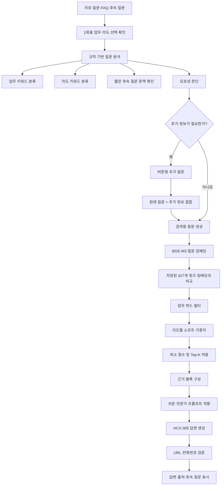
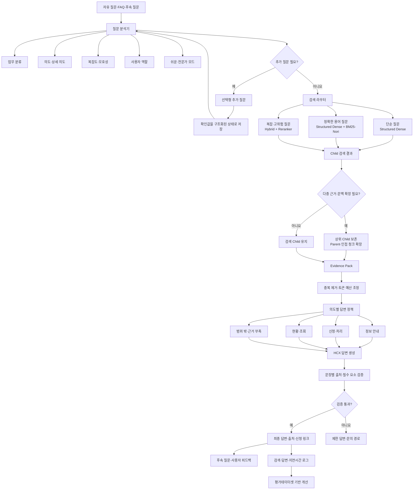

최신 V2.5는 단순 Dense RAG를 넘어, **업무·의도 분류, 추가 질문, 짧은 후속 문맥, 쉬운/전문가 모드까지 연결한 서비스형 베이스라인**입니다. 다만 검색 엔진 자체는 아직 기존 `content` 임베딩을 사용하는 Dense 검색입니다.

Smoke Test 결과도 정상입니다.

- 문서: 87개
- 청크: 427개
- 임베딩: BGE-M3, 1,024차원
- 업무·의도·추가 질문 테스트: 통과

---

# 1. 최신 베이스라인의 구성

주요 파일 역할은 다음과 같습니다.

| 파일 | 역할 |
|---|---|
| `app.py` | Streamlit UI, 대화 상태, 버튼·FAQ·추가 질문 처리 |
| `kdic_rag.py` | 데이터 로딩, 질문 분석, Dense 검색, HCX 답변 생성 |
| `faq_data.py` | 전체·업무별 FAQ, 후속 질문 |
| `smoke_test.py` | 데이터와 질문 분석 로직 기본 검증 |
| `data/processed` | 문서·청크·기존 BGE-M3 임베딩 |

핵심 코드는 [kdic_rag.py](</C:/Users/임도균/Documents/Codex/2026-07-22/d/work/KDIC_Streamlit_Chatbot_V2_5_review/KDIC_Streamlit_Chatbot_V2_5/kdic_rag.py:482>)와 [app.py](</C:/Users/임도균/Documents/Codex/2026-07-22/d/work/KDIC_Streamlit_Chatbot_V2_5_review/KDIC_Streamlit_Chatbot_V2_5/app.py:388>)에 있습니다.

---

# 2. 현재 질문 처리 과정

## 2.1 사용자 입력

질문은 다음 경로로 들어올 수 있습니다.

- 자유 질문
- 전체 FAQ TOP 5
- 업무별 FAQ
- 답변 뒤 후속 질문
- 추가 질문 선택지

사용자가 업무나 의도를 직접 선택할 수도 있지만, 선택값은 다음 질문 한 번에만 적용됩니다.

## 2.2 질문 분석

질문에 포함된 키워드로 6개 업무와 3개 의도를 분류합니다.

### 업무 분류

- 예금자보호제도
- 예금보험금 안내
- 고객 미수령금 신청
- 착오송금 반환 신청
- 채무조정 안내
- 은닉재산 신고

### 의도 분류

- 정보 안내
- 신청·처리
- 현황 안내

현재 분류기는 학습 모델이 아니라 키워드 점수 방식입니다.

```text
“착오송금 서류가 필요해요”
↓
착오송금 → 착오송금 반환 신청
서류 → 신청·처리
```

## 2.3 추가 질문 판단

다음과 같은 질문에는 검색을 바로 수행하지 않습니다.

```text
돈을 어떻게 받아?
→ 어떤 돈을 말씀하시나요?

서류가 필요해요
→ 어떤 업무에 관한 질문인가요?

착오송금 서류 알려줘
→ 어떤 입장에서 필요한 안내인가요?

예금보험금 서류 알려줘
→ 누가 예금보험금을 신청하나요?
```

사용자의 답변은 원래 질문과 결합됩니다.

```text
원래 질문: 예금보험금 서류 알려줘
추가 정보: 대리인

최종 검색 질문:
예금보험금 서류 알려줘
추가 정보: 대리인
```

## 2.4 짧은 후속 질문 처리

현재 버전은 완전한 대화 내용을 LLM에 전달하지는 않습니다. 대신 직전 업무·의도·질문을 이용해 짧은 후속 질문을 보완합니다.

```text
첫 질문:
예금보험금 신청 방법을 알려줘

후속 질문:
기간은?

검색용 질문:
업무: 예금보험금 안내
의도: 현황 안내
이전 질문: 예금보험금 신청 방법을 알려줘
현재 질문: 기간은?
```

목적형 챗봇에 적합한 제한적 문맥 처리입니다.

---

# 3. 현재 검색 방식

현재 검색은 기존 BGE-M3 Dense 임베딩 기반입니다.

```text
사용자 질문
↓
BGE-M3 질문 임베딩 생성
↓
기존 427개 청크 임베딩과 내적
↓
업무 필터
↓
의도별 소폭 점수 가산
↓
최소 유사도 적용
↓
Top-K 반환
```

검색 코드는 [kdic_rag.py](</C:/Users/임도균/Documents/Codex/2026-07-22/d/work/KDIC_Streamlit_Chatbot_V2_5_review/KDIC_Streamlit_Chatbot_V2_5/kdic_rag.py:540>)에 있습니다.

### 업무 설정

업무는 하드 필터입니다.

```python
if business_function:
    해당 업무의 청크만 검색
```

### 의도 설정

의도는 필터가 아니라 소프트 가중치입니다.

예를 들어 신청·처리 질문이면 다음 유형의 청크에 점수를 조금 더합니다.

- `application_documents`: +0.045
- `resource_group`: +0.030
- 신청·다운로드 Action: +0.025

따라서 의도 설정은 검색 결과를 완전히 제한하지 않고 순위를 조금 보정합니다.

---

# 4. 현재 답변 생성

검색된 청크를 근거 블록으로 만들어 HCX-005에 전달합니다.

```text
[근거 1]
문서 ID
청크 ID
업무
제목
소제목
출처 URL
본문

[근거 2]
...
```

답변 생성 시 다음 원칙이 들어갑니다.

- 검색 근거에 있는 정보만 사용
- 근거에 없는 금액·기한·조건 생성 금지
- 허용된 URL·전화번호만 사용
- 근거가 부족하면 확인할 수 없다고 답변
- 쉬운 설명과 전문가 설명의 표현 차등 적용

생성 후에는 검색 근거에 없는 URL과 전화번호를 제거합니다.

---

# 5. 현재 베이스라인 다이어그램



---

# 6. 잘 구현된 부분

이번 버전에서 서비스 측면의 골격은 상당히 좋아졌습니다.

- 업무·의도 수동 선택과 자동 분류를 함께 제공
- 수동 선택값을 1회만 적용하여 다음 질문 오염 방지
- 모호한 질문을 바로 검색하지 않고 추가 질문
- 직전 문맥을 제한적으로 활용
- 업무는 하드 필터, 의도는 소프트 가중치로 역할 분리
- 쉬운 설명과 전문가 설명 제공
- 공식 URL과 전화번호 허용 목록 적용
- 데이터 ZIP 교체 기능
- 개발 정보와 검색 점수 확인
- 기본 Smoke Test 제공

즉, 현재 버전은 단순히 질문을 검색기에 전달하는 UI가 아니라 **목적형 챗봇의 대화 제어 구조**를 갖추고 있습니다.

---

# 7. 현재 한계

## 7.1 검색은 아직 Content Dense

저장된 임베딩의 `input_content_sha256`가 청크의 `content_hash`와 일치합니다. 즉 제목·소제목·브레드크럼을 포함한 Structured 임베딩이 아니라 본문 중심 임베딩입니다.

현재 코드에서 제목을 검색 결과에 표시하는 것과 제목을 임베딩에 포함하는 것은 다릅니다.

Structured Dense를 적용하려면 427개 청크를 다음 형식으로 다시 임베딩해야 합니다.

```text
제목 + 소제목 + heading_path + 본문
```

## 7.2 업무 분류의 신뢰도가 실제 확률은 아님

현재 confidence는 키워드 점수로 만든 규칙값입니다.

```python
confidence = 0.55 + 0.15 × 키워드 점수 ...
```

학습 모델이 계산한 확률은 아닙니다. 잘못 분류한 업무에 하드 필터를 적용하면 정답 청크가 검색 대상에서 완전히 제외될 수 있습니다.

## 7.3 검색된 청크 전체가 출처로 표시됨

Top-K 청크를 모두 출처로 표시하지만, LLM이 실제 답변에 어떤 청크를 사용했는지는 구분하지 않습니다.

향후에는 다음을 나눠야 합니다.

- 검색 후보
- 답변에 전달한 근거
- 실제 답변 문장을 지지한 근거

## 7.4 쉬운·전문가 모드는 표현만 다름

현재 검색 결과는 동일하고 프롬프트의 설명 방식만 바뀝니다. 이는 기본 방향으로는 적절합니다.

다만 전문가 모드에서는 다음이 추가로 검증되어야 합니다.

- 적용 조건
- 예외
- 기준일
- 법적 근거
- 관련 문서

## 7.5 추가 질문 정책이 규칙에 의존

현재 대표적인 모호 질문은 잘 처리하지만 평가데이터셋의 모든 모호성을 포괄하지는 못합니다.

필요한 평가 필드는 다음과 같습니다.

- `gold_ambiguity_status`
- `gold_expected_action`
- `gold_clarification_question`
- `gold_clarification_options`

## 7.6 검색 고도화 기능은 아직 없음

README에 명시된 것처럼 현재 서비스에는 다음 기능이 없습니다.

- Structured Dense
- BM25-Nori
- Hybrid Search
- Reranker
- Parent–Child Retrieval

---

# 8. 고도화 우선순위

## 1단계: Structured Dense

가장 먼저 적용할 만합니다.

```text
현재:
content → BGE-M3

개선:
title + section_title + heading_path + content → BGE-M3
```

기존 평가에서 Structured Dense가 Content Dense보다 좋은 결과를 보였으므로 우선순위가 높습니다.

## 2단계: Hybrid Search

```text
Structured Dense Top-20
+
BM25-Nori Top-20
↓
Weighted RRF
```

정확한 제도명·양식명·서류명은 BM25가 보완하고 자연어 표현은 Dense가 보완합니다.

## 3단계: 조건부 Reranker

모든 질문에 적용하기보다 다음 질문에 적용합니다.

- 다중 조건 질문
- 신청 자격·필요 서류
- 검색 상위 점수가 비슷한 경우
- 서로 다른 문서가 상위에 혼입된 경우
- 고위험 정보 질문

## 4단계: 선택적 Parent–Child

다음 질문에만 적용하는 것이 좋습니다.

- 절차와 서류를 함께 묻는 질문
- 조건·예외가 포함된 질문
- `multi_chunk_required=Y`
- 검색 청크의 문맥이 중간에서 잘린 경우

## 5단계: 근거 검증

답변을 구조화된 형태로 생성합니다.

```json
{
  "answer": "...",
  "citations": [
    {
      "claim": "대리 신청에는 위임장이 필요합니다.",
      "chunk_id": "BI-001_chunk_006"
    }
  ],
  "required_elements": ["신청 대상", "필요 서류", "신청 페이지"],
  "limitations": []
}
```

---

# 9. 고도화된 다이어그램



---

# 10. 현실적인 최종 구조

이 서비스에 모든 질문을 대상으로 가장 무거운 검색을 적용할 필요는 없습니다.

| 질문 | 검색 방식 |
|---|---|
| “예금은 얼마까지 보호되나요?” | Structured Dense |
| “부채증명원이 뭔가요?” | Structured Dense 또는 Hybrid |
| “예금보험금 대리 신청 서류는?” | Hybrid + Reranker |
| “상속인이 신청할 때 절차와 서류는?” | Hybrid + Reranker + Parent–Child |
| “돈 어떻게 받아?” | 추가 질문 후 검색 |

최종적으로는 다음 방향이 적절합니다.

> 현재 V2.5의 UI·추가 질문·상태 관리 구조는 유지하고, 내부 Dense 검색기를 Structured Dense → Hybrid → 조건부 Reranker → 선택적 Parent–Child 구조로 교체한다.

가장 중요한 점은 UI를 다시 만드는 것이 아니라, 현재 `KDICRAGEngine.search()` 내부를 단계적으로 교체하고 결과 형식을 확장하는 것입니다. 현재 서비스 골격 위에 검색 고도화 결과를 올리는 방식이 가장 안정적입니다.
