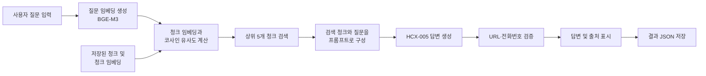
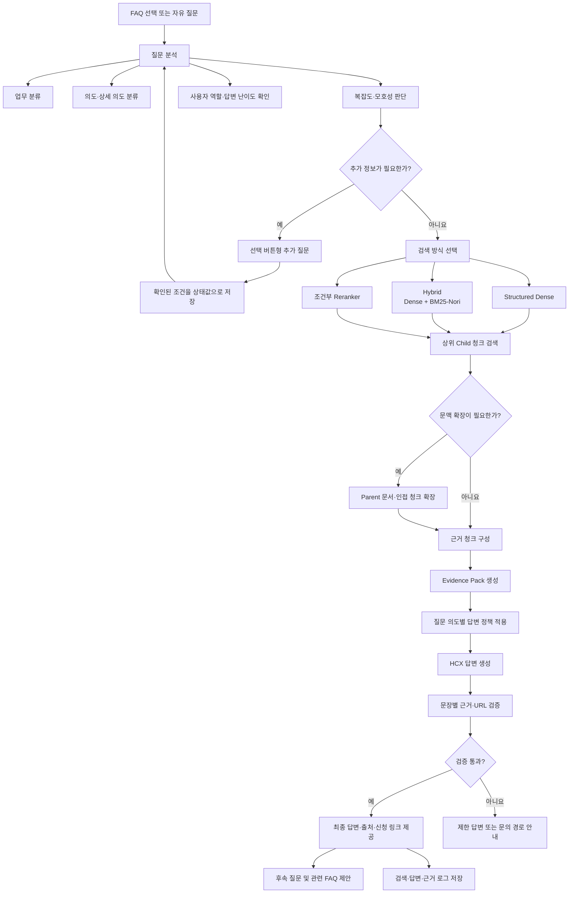

# KDIC RAG 챗봇 베이스라인 분석 및 고도화 방향

## 1. 현재 베이스라인 개요

현재 베이스라인은 사용자의 질문과 KDIC 문서 청크를 임베딩 벡터로 변환한 뒤, 코사인 유사도가 높은 청크를 검색하고 LLM이 이를 근거로 답변하는 기본적인 RAG 구조이다.

### 현재 동작 과정

1. `documents.jsonl`, `chunks.jsonl`, `chunk_embeddings_hcx.jsonl` 로드
2. 사용자 질문 입력
3. BGE-M3로 질문 임베딩 생성
4. 저장된 청크 임베딩과 코사인 유사도 계산
5. 유사도가 높은 상위 5개 청크 검색
6. 검색 청크와 시스템 프롬프트를 HCX-005에 전달
7. 근거 기반 답변 생성
8. 답변과 검색 결과를 JSON으로 저장

### 현재 적용된 기술

| 구분 | 적용 내용 |
|---|---|
| 임베딩 모델 | BGE-M3 |
| 검색 방식 | Dense Search |
| 유사도 계산 | 코사인 유사도 |
| 검색 범위 | 상위 5개 청크 |
| 답변 모델 | HCX-005 |
| 업무 필터 | 사용자가 직접 지정할 경우 적용 |
| 안전장치 | 공식 URL·전화번호 허용 목록 |
| 결과 저장 | 질문·검색 결과·답변을 JSON으로 저장 |

---

## 2. 현재 베이스라인 다이어그램



이 구조는 RAG의 기본 흐름을 이해하고, 질문에 대해 실제 답변이 생성되는지 확인하는 초기 베이스라인으로 적절하다.

---

## 3. 현재 베이스라인의 장점

- 기존에 생성된 427개 청크와 임베딩을 바로 활용할 수 있다.
- 질문 임베딩만 새로 생성하므로 매번 전체 데이터를 임베딩하지 않는다.
- 검색 결과와 답변을 JSON으로 저장하여 오류 분석이 가능하다.
- 검색된 문서를 근거로 답하도록 프롬프트가 구성되어 있다.
- 공식 URL과 전화번호만 답변에 사용할 수 있도록 기본적인 안전장치가 있다.
- 구조가 단순하여 팀원이 RAG 전체 흐름을 학습하기 좋다.

---

## 4. 현재 베이스라인에서 보완할 부분

### 4.1 검색 방식이 Dense Search 하나로 제한됨

현재는 질문과 청크 본문의 의미적 유사성만 비교한다. 문서명, 부제목, 브레드크럼과 같은 구조 정보나 정확한 키워드가 충분히 반영되지 않을 수 있다.

예를 들어 `부채증명원`, `보호한도`, `신청기한`처럼 정확한 용어가 중요한 질문은 BM25 검색이 더 유리할 수 있다.

### 4.2 업무 분류가 자동화되지 않음

현재 업무 필터는 사용자가 직접 선택해야 한다. 업무를 선택하지 않으면 6개 업무 전체에서 검색하므로 비슷한 표현을 가진 다른 업무의 청크가 섞일 수 있다.

### 4.3 실제 사용 근거와 검색 결과가 구분되지 않음

검색된 상위 5개 청크가 모두 출처로 표시될 수 있지만, LLM이 실제 답변 작성에 모든 청크를 사용했다고 보기는 어렵다.

따라서 다음을 구분할 필요가 있다.

- 검색된 후보 청크
- LLM에 제공한 청크
- 최종 답변에 실제 사용한 근거 청크

### 4.4 대화 기록이 후속 질문 검색에 활용되지 않음

현재 `chat_history`는 결과를 저장하는 용도에 가깝다. 사용자가 다음과 같이 질문하면 앞선 문맥을 검색에 반영하기 어렵다.

> 사용자: 예금보험금 신청 방법 알려줘.  
> 사용자: 부모님 대신 신청할 수 있어?

두 번째 질문을 독립적으로 검색하면 무엇을 대신 신청하는 것인지 알기 어렵다.

### 4.5 모호한 질문에 대한 추가 질문 기능이 없음

다음과 같은 질문에는 바로 답하기보다 추가 확인이 필요하다.

- “방문 신청은 어디서 해요?”
- “대신 신청할 수 있나요?”
- “언제까지 해야 하나요?”
- “조회하고 싶어요.”

업무, 신청 대상, 사용자 역할 등이 정해지지 않은 상태에서 답변하면 다른 업무의 절차를 안내할 위험이 있다.

### 4.6 답변 형태가 질문 목적에 따라 구분되지 않음

정보를 묻는 질문과 실제 신청을 원하는 질문은 답변 구성이 달라야 한다.

- 정보 질문: 핵심 정보와 출처
- 신청 질문: 신청 대상, 절차, 필요 서류, 양식, 신청 페이지
- 조회 질문: 조회 방법과 조회 페이지
- 모호한 질문: 추가 질문
- 범위 밖 질문: 답변 제한과 문의 경로

---

# 5. 고도화된 챗봇의 방향

KDIC 챗봇은 모든 주제를 자유롭게 대화하는 범용 챗봇보다, 예금보험 관련 질문을 정확한 근거와 함께 처리하는 목적형 챗봇으로 설계하는 것이 적절하다.

대화를 완전히 배제하는 것은 아니지만 다음 범위에서만 제한적으로 활용한다.

- 모호한 질문의 조건 확인
- 직전 질문에 대한 후속 질문
- 신청 대상·사용자 역할·신청 방식 확인
- 답변 난이도 조정
- 관련 후속 질문 제안

---

## 6. 추가하면 좋은 기능

### 6.1 질문 분석기

검색 전에 질문을 다음 기준으로 분석한다.

| 분석 항목 | 예시 |
|---|---|
| 업무 | 예금자보호제도, 예금보험금, 미수령금, 착오송금, 채무조정, 은닉재산 |
| 의도 | 정보 안내, 신청·처리, 조회, 추가 확인, 범위 밖 |
| 상세 의도 | 신청 자격, 필요 서류, 신청 기한, 처리 절차, 보호한도 |
| 복잡도 | 단순, 조건형, 다중 조건, 다중 의도, 모호 |
| 사용자 역할 | 본인, 대리인, 미성년자, 상속인, 법인 |
| 답변 난이도 | 쉬운 설명, 전문가 설명 |

사용자가 업무나 의도를 직접 선택한 경우에는 선택값을 우선하고, 선택하지 않은 경우 모델이 자동 분류한다.

### 6.2 검색 라우터

모든 질문에 무거운 검색 방식을 적용하지 않고 질문 특성에 따라 검색 방식을 선택한다.

| 질문 조건 | 권장 검색 방식 |
|---|---|
| 일반적인 단순 질문 | Structured Dense |
| 정확한 명칭·서식·금액 질문 | Structured Dense + BM25-Nori |
| 복잡하거나 검색 신뢰도가 낮은 질문 | Hybrid + Reranker |
| 절차·조건·예외가 함께 필요한 질문 | Parent–Child 확장 |
| FAQ와 동일한 질문 | FAQ 캐시 또는 검증된 답변 |

### 6.3 Structured Dense 검색

청크 본문만 임베딩하지 않고 다음 정보를 함께 구성한다.

```text
업무: 예금보험금 안내
문서 제목: 예금보험금 신청 안내
부제목: 대리인이 신청하는 경우
브레드크럼: 예금보험금 > 신청 방법 > 대리 신청
본문: ...
```

이를 통해 비슷한 본문을 가진 다른 업무의 청크가 섞이는 현상을 줄일 수 있다.

### 6.4 Hybrid Search

Dense 검색과 BM25-Nori 검색 결과를 결합한다.

- Dense: 비슷한 의미 탐색
- BM25-Nori: 정확한 용어와 고유명사 탐색
- RRF: 두 검색 결과의 순위를 결합

단순 질문에는 Structured Dense만 적용하고, 어려운 질문에만 Hybrid 또는 Reranker를 적용하면 응답 시간과 비용을 줄일 수 있다.

### 6.5 조건부 Reranker

Reranker는 모든 질문에 적용하지 않고 다음 상황에 선택적으로 적용한다.

- 검색 점수가 전체적으로 낮은 경우
- 상위 청크 점수가 비슷한 경우
- 여러 문서의 청크가 섞인 경우
- 다중 조건·다중 의도 질문
- 신청 자격이나 필요 서류처럼 오답 위험이 큰 질문

### 6.6 Parent–Child Retrieval

검색은 짧은 Child 청크로 수행하고, 답변 생성 시 해당 청크가 속한 Parent 문서나 인접 청크를 추가한다.

예를 들어 검색된 청크에 신청 서류만 있고 앞 청크에 신청 대상이 있다면, 두 내용을 함께 LLM에 제공하여 조건 누락을 방지한다.

이때 검색 상위 Child 청크는 반드시 유지하고 필요한 Parent 문맥만 확장해야 한다.

### 6.7 추가 질문 처리

질문이 모호하면 답변을 추측하지 않고 선택형 추가 질문을 제공한다.

> 대신 신청할 수 있나요?

챗봇:

> 어떤 업무의 대리 신청을 찾으시나요?

- 예금보험금
- 미수령금
- 착오송금 반환지원
- 직접 입력

확인된 값은 대화 전체를 저장하는 대신 `업무=예금보험금`, `사용자 역할=대리인`과 같이 구조화된 상태로 보관한다.

### 6.8 질문 목적별 응답 정책

| 의도 | 답변 정책 |
|---|---|
| INFORMATION | 핵심 정보와 공식 출처 제공 |
| ACTION | 대상·절차·서류·양식·신청 페이지 제공 |
| STATUS | 조회 방법과 조회 페이지 안내 |
| CLARIFICATION | 필요한 조건을 한 번에 하나씩 질문 |
| OUT_OF_SCOPE | 답변 범위를 알리고 공식 문의 경로 안내 |

### 6.9 쉬운 설명·전문가 설명

두 모드는 사실과 근거는 동일하게 유지하고 표현 방법만 변경한다.

- 쉬운 설명: 짧은 문장, 전문용어 풀이, 핵심 행동 중심
- 전문가 설명: 조건, 예외, 기준, 관련 용어를 상세히 제공

쉬운 설명 모드가 정보를 임의로 생략하거나 전문가 모드가 근거 없는 내용을 추가하지 않도록 해야 한다.

### 6.10 근거 단위 출처 표시

답변 마지막에 URL만 나열하는 것보다 문장 또는 항목별로 근거를 연결한다.

```text
예금보험금은 본인뿐 아니라 요건을 갖춘 대리인도 신청할 수 있습니다. [근거 1]

필요 서류
- 부채증명원 발급신청서 [근거 2]
- 위임장 및 대리인 신분증 [근거 3]
```

출처에는 다음 정보를 표시한다.

- 문서 제목
- 부제목
- 브레드크럼
- 공식 페이지 URL
- 필요시 첨부 양식 링크

---

# 7. 고도화된 베이스라인 다이어그램



---

## 8. 고도화 후 예상되는 구성

```text
사용자 인터페이스
    ↓
질문 분석
    ├─ 업무
    ├─ 의도
    ├─ 복잡도
    └─ 모호성
    ↓
필요시 추가 질문
    ↓
검색 라우터
    ├─ Structured Dense
    ├─ Hybrid
    └─ Hybrid + Reranker
    ↓
선택적 Parent–Child 확장
    ↓
근거 묶음(Evidence Pack)
    ↓
의도별 답변 생성
    ↓
출처·URL·필수 응답 요소 검증
    ↓
쉬운 설명 또는 전문가 설명
```

---

## 9. 구현 우선순위

한 번에 모든 기능을 추가하기보다 다음 순서가 현실적이다.

### 1단계: 답변 베이스라인 보완

- Structured Dense 적용
- 업무 자동 분류
- 출처를 문서 제목·부제목·URL 형태로 표시
- 검색 후보와 실제 답변 근거 구분
- 검색·답변 결과 로그 개선

### 2단계: 목적형 챗봇 구성

- INFORMATION·ACTION·STATUS 등 의도 분류
- 모호한 질문에 대한 추가 질문
- 신청 질문용 답변 양식
- 쉬운 설명·전문가 설명 모드
- 직전 질문의 구조화된 조건 유지

### 3단계: 검색 고도화

- BM25-Nori와 Structured Dense 결합
- 조건부 Reranker
- 선택적 Parent–Child 확장
- 검색 점수에 따른 신뢰도 판단

### 4단계: 품질 검증

- 평가데이터셋 기반 검색 평가
- 답변 필수 요소 충족 여부 평가
- 출처 정확성 평가
- 모호한 질문의 추가 질문 정확성 평가
- 응답 시간과 API 비용 측정

---

## 10. 최종 제안

현재 코드는 버릴 대상이 아니라, 다음 구조로 확장하기 좋은 기본 골격이다.

> 현재 베이스라인  
> 질문 → Dense 검색 → LLM 답변

> 권장 베이스라인  
> 질문 분석 → 필요시 추가 질문 → 검색 방식 선택 → 근거 확장 → 의도별 답변 → 출처 검증

첫 번째 구현 목표는 모든 기능을 갖춘 완성형 챗봇보다는 다음 세 가지가 확실히 동작하는 버전으로 잡는 것이 좋다.

1. 질문의 업무와 의도를 파악한다.
2. 검증된 근거 청크를 검색한다.
3. 질문 목적에 맞는 답변과 정확한 출처를 제공한다.

이 구조가 완성된 이후에 조건부 Reranker, Parent–Child, 쉬운 설명 모드 등을 하나씩 추가하면서 평가데이터셋으로 개선 효과를 확인하면 된다.
